# Kubernetes End to End Project on EKS(Amazon Kubernetes Service)


## ✅ Project Title: Deploying 2048 Game App on Amazon EKS

## ✅ Project Description

***A Kubernetes End-to-End (E2E) project for deploying a 2048 game app on Amazon Elastic Kubernetes Service (EKS) involves setting up, deploying, and managing the popular 2048 game application on a Kubernetes cluster running on AWS EKS. This project aims to demonstrate how to containerize a web application, deploy it on EKS, manage the cluster, and expose the application to users.***

## ✅ Containerization

***I began by containerizing the 2048 game using Docker. This involved creating a Dockerfile to define the application's runtime environment and dependencies, ultimately resulting in a Docker image ready for deployment.***

## ✅ Amazon EKS Setup

***I set up an Amazon EKS cluster, configuring the required resources and network settings using AWS services. This step included authentication and permissions setup to interact with the EKS cluster.***

## ✅ Deployment

***The containerized 2048 game was deployed on the EKS cluster using Kubernetes. I defined Kubernetes deployment and service YAML files to ensure the application's efficient management and availability.***

## ✅ Scaling and Management

***I explored Kubernetes's scaling capabilities, adjusting the number of application replicas based on demand. This ensured the game could handle varying levels of user traffic seamlessly***

## ✅ Application Exposure

***To make the 2048 game accessible to users, I created a Kubernetes service to expose it securely over the internet. Additionally, I could have implemented an Ingress controller for more advanced routing***

### Step 1: Create an EKS cluster

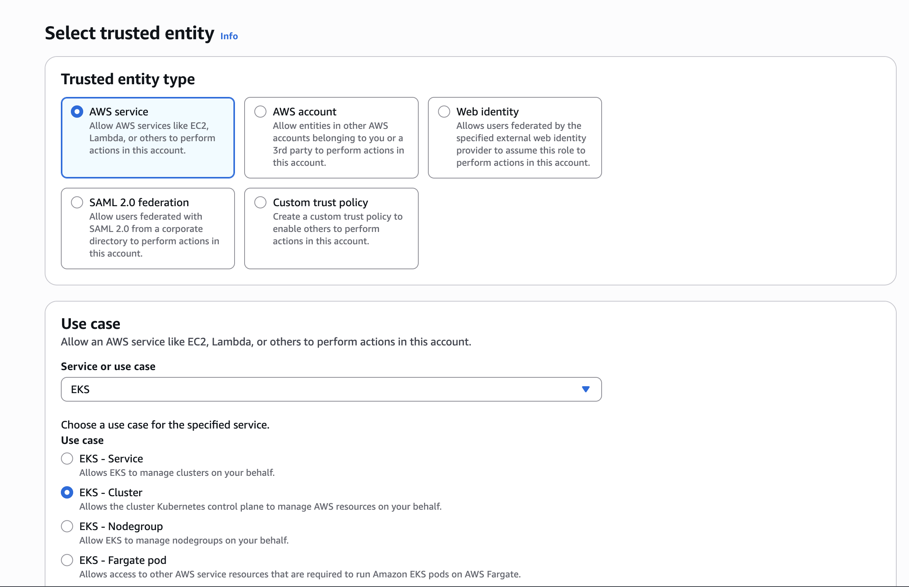

### Step 2: Create an IAM role **eks-cluster-role** with 1 policy attached: AmazonEKSClusterPolicy

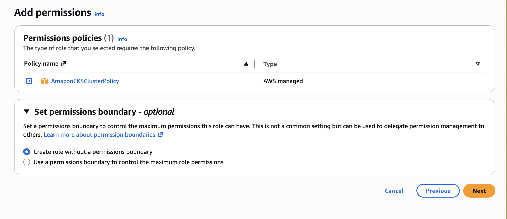

```
Create another IAM role 'eks-node-grp-role' with 3 policies attached: 
(Allows EC2 instances to call AWS services on your behalf.)
    - AmazonEKSWorkerNodePolicy
    - AmazonEC2ContainerRegistryReadOnly
    - AmazonEKS_CNI_Policy
```

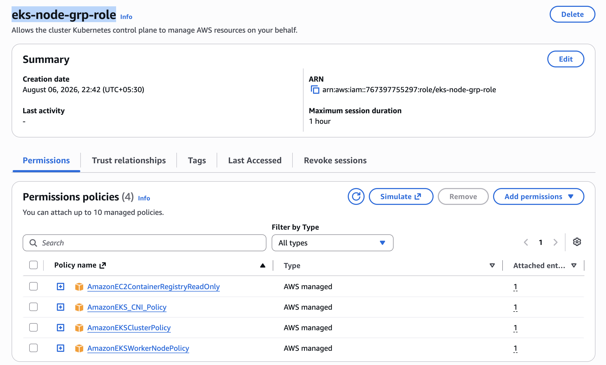

```
Choose default VPC, Choose 2 or 3 subnets
Choose a security group which open the ports 22, 80, 8080
cluster endpoint access: public

# For VPC CNI, CoreDNS and kube-proxy, choose the default versions, For CNI, latest and default are 
# different. But go with default.

Click 'Create'. This process will take 10-12 minutes. Wait till your cluster shows up as Active.
```

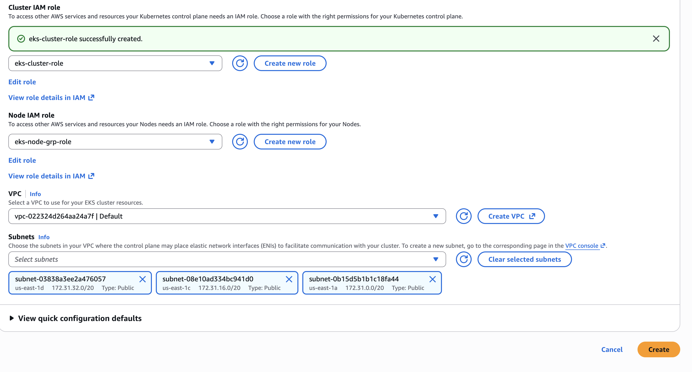

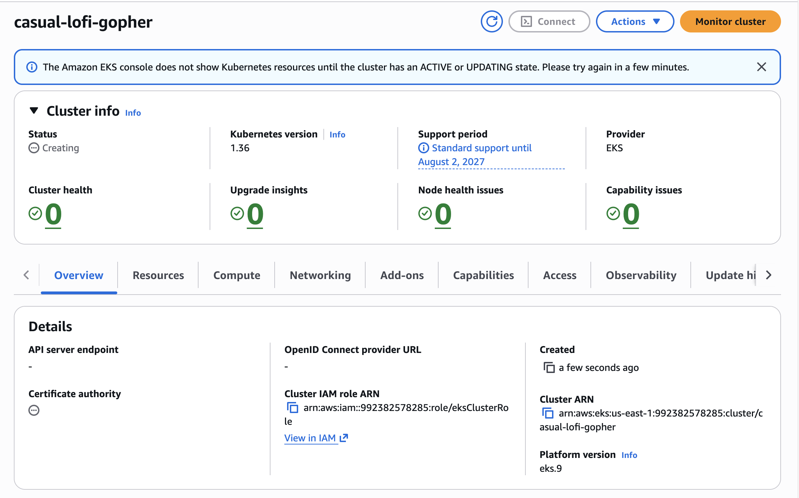


### Step 3: Add Worker Node using EC2 Instance

```
Note : Due to sandbox restriction , i had to manually create a worker node and add it to EKS cluster  

Below are the steps which i performed to create and add node to AWS EKS

1. Create a EC2 instance with EKS-optimized ami (whichever is suitable)
2. Add the VPC and subnet of same created aws eks cluster    
3. Create the instance and connect to the instance
```

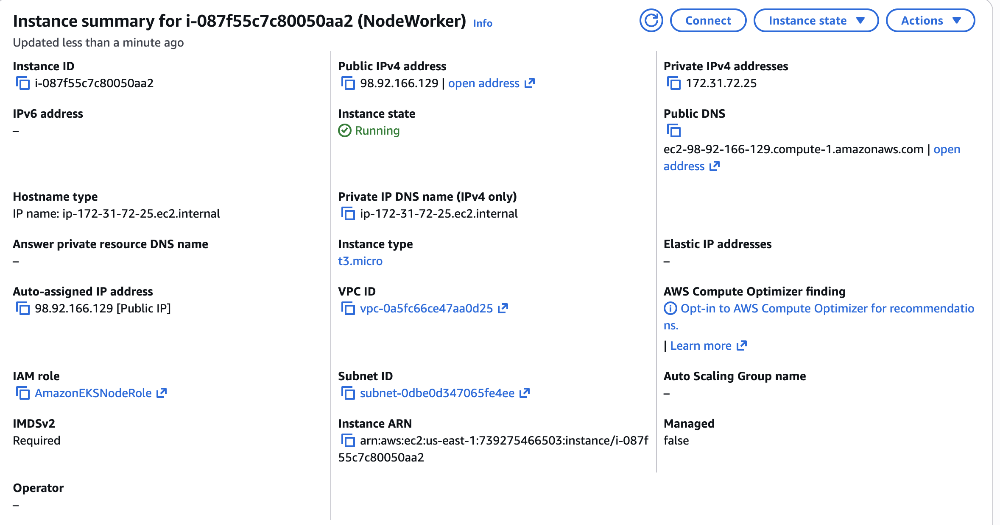


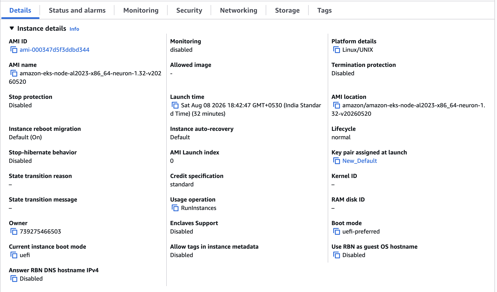


```
4. Now we have to run below commands to convey the nodeadm of AWS EKS server about the EC2 instance being used for as a worker node.
5. Create a nodeconfig.yaml file and add below details

apiVersion: node.eks.aws/v1alpha1
kind: NodeConfig
spec:
  cluster:
    name: <CLUSTER_NAME>
    apiServerEndpoint: https://<your-cluster-endpoint>.eks.amazonaws.com
    certificateAuthority: <base64-encoded-ca-cert>
    cidr: 10.100.0.0/16


6. Run the below command to apply the nodeconfig.yaml file
sudo nodeadm init -c file://$(pwd)/nodeconfig.yaml
```
```
7. After adding connect to AWS EKS Cluster admin server , and add below configMap 

cat <<EOF | kubectl apply -f -
apiVersion: v1
kind: ConfigMap
metadata:
  name: aws-auth
  namespace: kube-system
data:
  mapRoles: |
    - rolearn: arn:aws:iam::<ACCOUNT_ID>:role/<EKS_WORKER_NODE_ROLE>
      username: system:node:<DNS_WORKER_NODE>
      groups:
        - system:bootstrappers
        - system:nodes
EOF
```

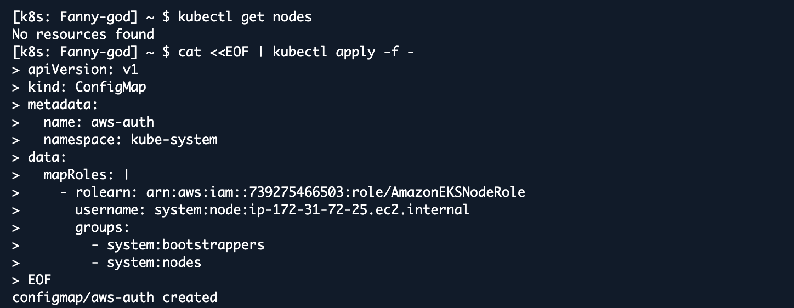

```
Error occured after completing steps 1-7 , solution in step 8 
```

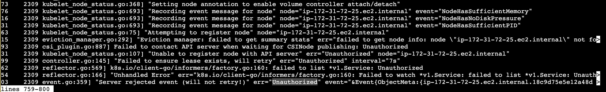


```
8. We also need to add access point to allow the worker node to establish into AWS EKS as a node resource . Run below command

aws eks create-access-entry \
  --cluster-name  <CLUSTER_NAME>\
  --principal-arn arn:aws:iam::<ACCOUNT_ID>:role/<EKS_WORKER_NODE_ROLE> \
  --type EC2_LINUX

```

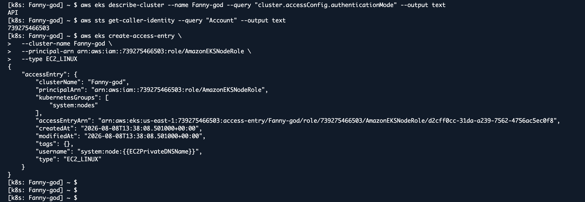

```
9 . Now check if the nodes are visible in AWS EKS cluster 
```

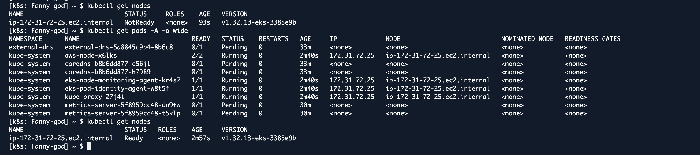

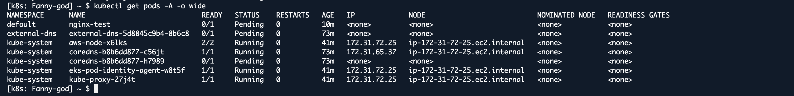


### Step 4: Create a new POD in EKS for the 2048 game

```
apiVersion: v1
kind: Pod
metadata:
   name: 2048-pod
   labels:
      app: 2048-ws
spec:
   containers:
   - name: 2048-container
     image: public.ecr.aws/l6m2t8p7/docker-2048:latest
     ports:
       - containerPort: 80
```
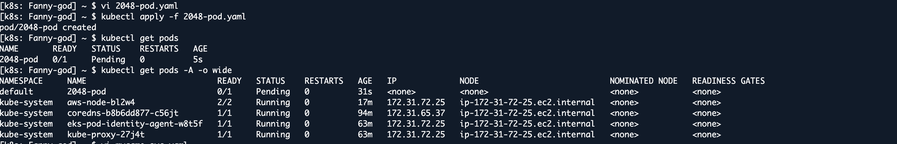

```
# apply the config file to create the pod
kubectl apply -f 2048-pod.yaml
#pod/2048-pod created

# view the newly created pod
kubectl get pods
```

```
NOTE : After creating the pods , ecountered an issue . As the EC2 Instance used as worker Node is t3.micro which only allows 4 pods as every pod requires a IP address to be assigned . And AWS EKS has already 4 pods running as add-ons . Hence, I had to add new EC2 Instance to get extra resources to run extra 4 pods

Steps to get new worker node remains the same from above.

```
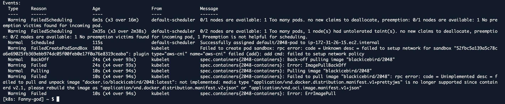


```
Added new EC2 instance as workernode 

```

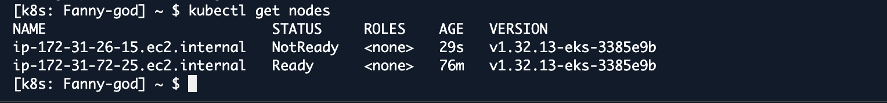


```
After that , pods started successfully
```

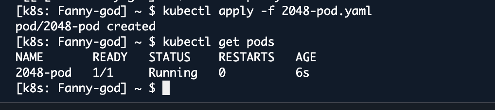

### Step 6: Setup Load Balancer Service

```
apiVersion: v1
kind: Service
metadata:
   name: mygame-svc
spec:
   selector:
      app: 2048-ws
   ports:
   - protocol: TCP
     port: 80
     targetPort: 80
   type: LoadBalancer
```
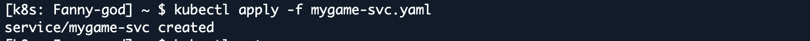
```
# apply the config file
kubectl apply -f mygame-svc.yaml
```
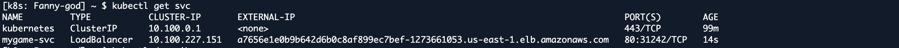
```
# view details of the modified service
kubectl describe svc mygame-svc
```
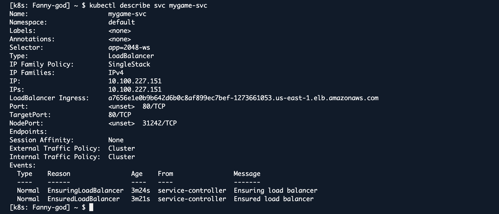

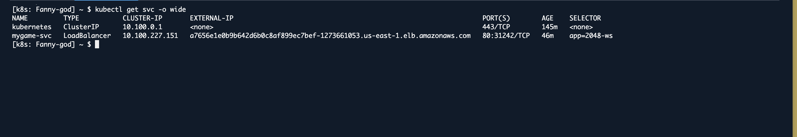

```
# Access the LoadBalancer Ingress on the kops instance
curl <LoadBalancer_Ingress>:<Port_number>
or
curl a06aa56b81f5741268daca84dca6b4f8-694631959.us-east-1.elb.amazonaws.com:80
(try this from your laptop, not from your cloudshell)
```


```
# Go to EC2 console. get the DNS name of ELB and paste the DNS into address bar of the browser
# It will show the 2048 game. You can play. (need to wait for 2-3 minutes for the 
# setup to be complete)
```
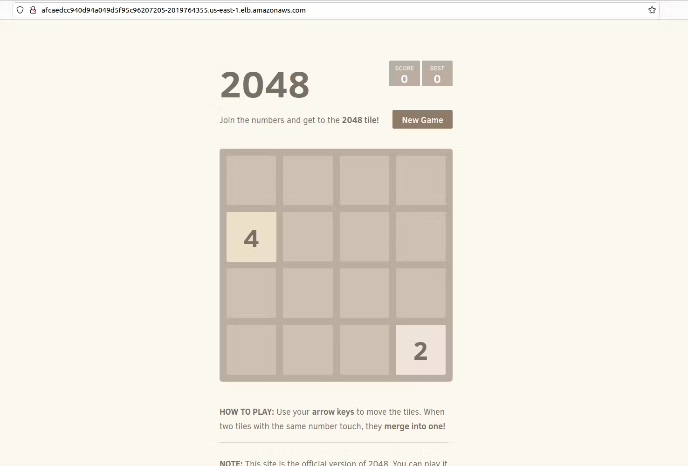