# AWS-Project-01: Infrastructure as Code (IaC) with Terraform to host a simple web server in AWS (Beginners)


In this project, we will deploy a single EC2 instance on AWS using Terraform to host a simple web server. This involved setting up and configuring the necessary infrastructure via code, ensuring it’s accessible over the internet.

Let’s go! 🤘

**Technologies Used**

* **AWS**: As the cloud provider to host the infrastructure.
    
* **Terraform**: For infrastructure as code, to provision and manage the AWS resources.
    
* **Apache HTTP Server**: Chosen as the web server software to serve web content.
    

### **Prerequisites**

* An AWS account. (Will be using Sandbox)
    
* Basic knowledge of AWS services (EC2, RDS, VPC, etc.).
    
* An IAM user with sufficient permissions to create and manage AWS resources.
    

### **Step 1: Setup Terraform Project**

First, make a new directory for your Terraform project and navigate into it.

```bash
mkdir terraform-multi-tier-app
cd terraform-multi-tier-app
```

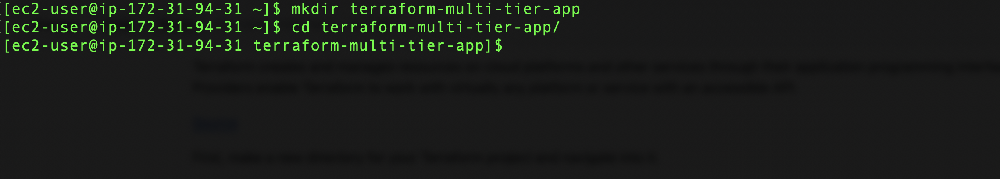

Initialise the directory with Terraform to prepare your working directory for other commands.

```bash
terraform init
```

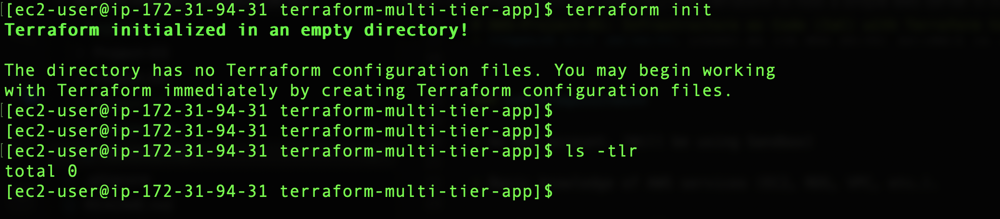

### **Step 2: Define AWS Provider**

Create a file named provider.tf and specify your AWS provider and region.

```go
provider "aws" {
  region = "eu-west-1"  # Choose the region appropriate for you
}
```

For me, that’s eu-west-1

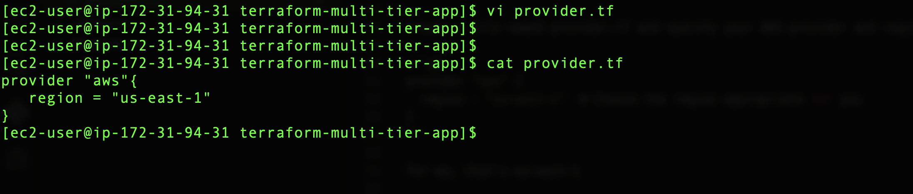

### **Step 3: Create an EC2 Instance**

Create a file named main.tf.

```go
resource "aws_instance" "example" {
  ami        = "ami-04e49d62cf88738f1"  # Replace this with the latest Amazon Linux AMI in your region
  instance_type = "t2.micro"

  tags = {
 Name = "SimpleWebServer"
  }
}
```


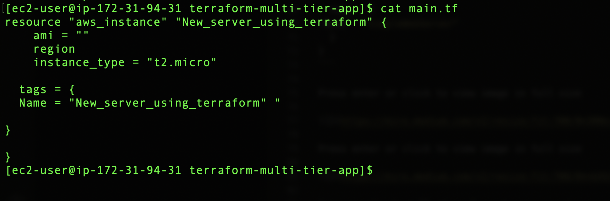


Automate the installation of a web server and serve a simple HTML page. Update the aws\_instance resource to include user data.

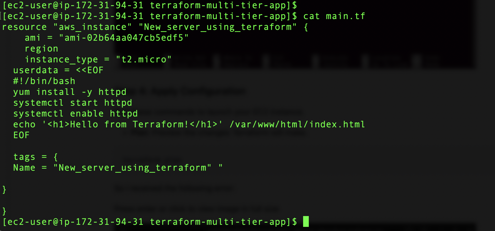

### **Step 4: Apply Configuration**

Run these commands to launch your EC2 instance.

* **Plan**: Preview the changes Terraform will make.
    

```bash
terraform plan
```

So I received the following error:

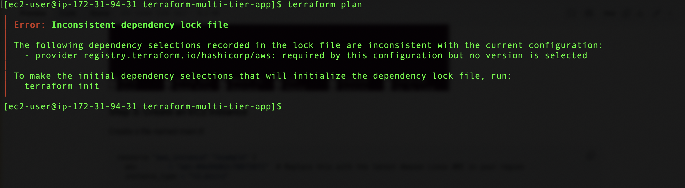

To fix this, I ran “terraform init”

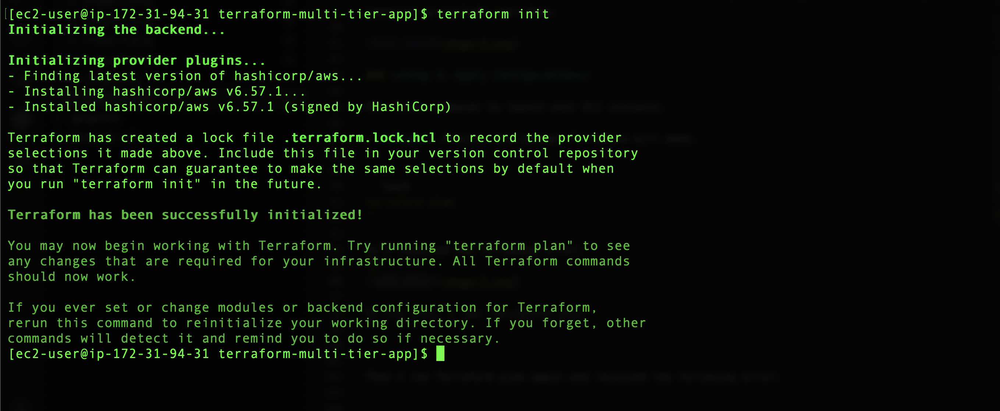

Then I ran Terraform plan again and received the following error:

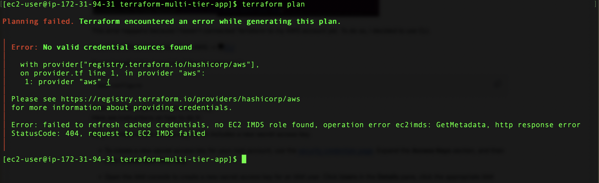

This error happens because I haven’t connected Terraform to my AWS account yet. To do so, I decided to use CLI.

I used the official instruction from AWS -&gt; 💻[CLI](https://docs.aws.amazon.com/cli/latest/userguide/getting-started-install.html)

Once I installed CLI, I used the following command:

```bash
aws configure
```

Then we have to generate an access key.  
Here are instructions on how to do it:

**Step 1:** Create a new access key, which includes a new secret access key.

* To create a new secret access key for your root account, use the [security credentials page](https://console.aws.amazon.com/iam/home?#security_credential). Expand the **Access Keys** section, and then click **Create New Root Key**.
    
* Open the IAM console to create a new secret access key for an IAM user. Click **Users** in the **Details** pane, click the appropriate IAM user, and then click **Create Access Key** on the **Security Credentials** tab.
    

**Step 2:** Download the newly created credentials, when prompted to do so in the key creation wizard.

[💻 Source](https://aws.amazon.com/blogs/security/wheres-my-secret-access-key/)

Here we provide our credentials to access our AWS account.


It works! 🚀  
It shows what ami will be used and what instance type will be created.  
Now I run the following command:

```plaintext
terraform plan
```

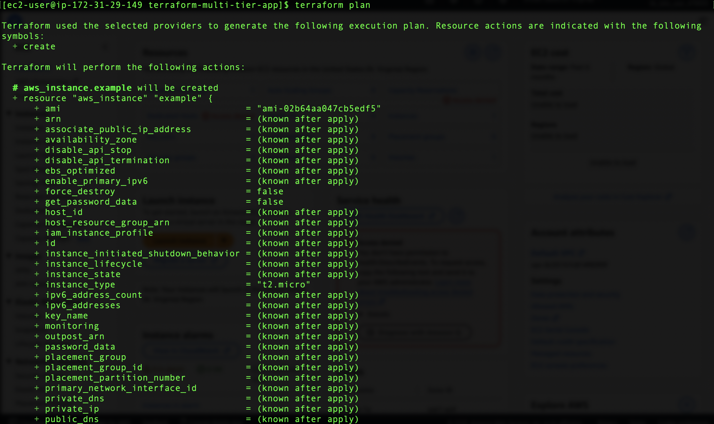


**Apply:** Create the resources on AWS. Now I run the following command:

```bash
terraform apply
```

Press enter or click to view image in full size

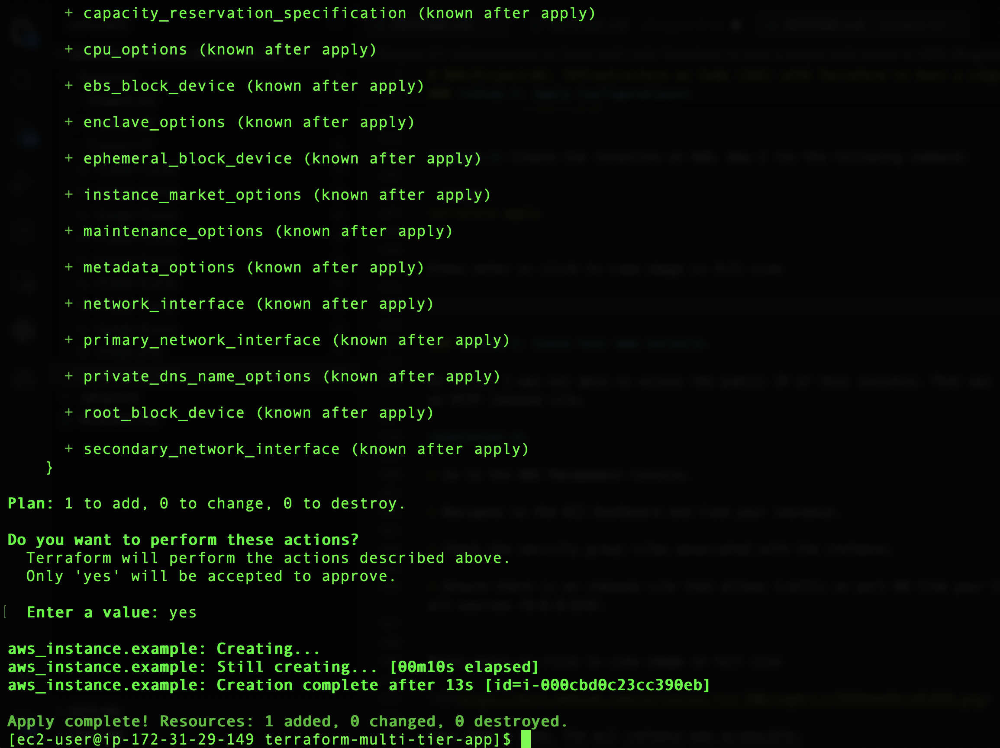

### **Step 5: Check Your Web Server**

    
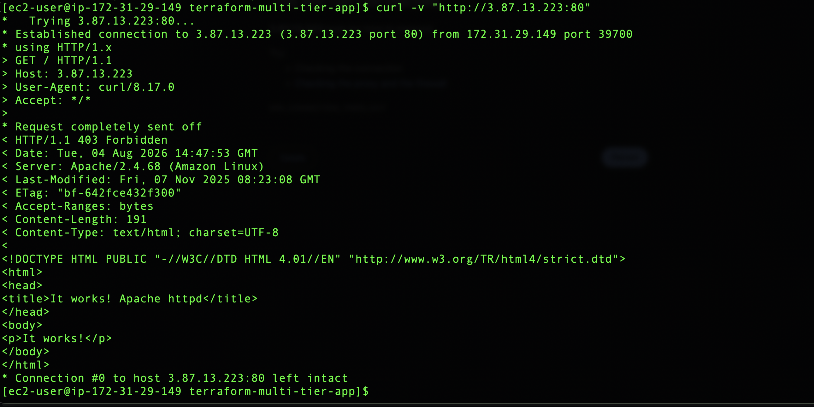

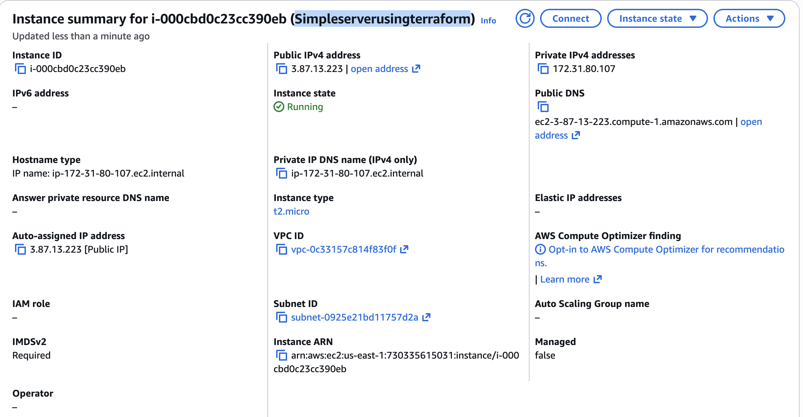

Once that’s done, the ec2 instance was accessible.  
**As you can see it works! 🚀🚀🚀**

