# DevSecOps (DevOps) Project: Deploying a Petshop Java-Based Application with CI/CD, Docker, and Kubernetes


# **Introduction**

In this blog, I will walk you through the process of deploying a **Petshop Java-Based Application using Jenkins as a CI/CD tool**. This deployment utilizes Docker for containerization, Kubernetes for container orchestration, and incorporates various security measures and automation tools like Terraform, SonarQube, Trivy, and Ansible. This project showcases a comprehensive approach to modern application deployment, emphasizing automation, security, and scalability.

This project was an incredible learning experience, providing hands-on practice with a variety of tools and technologies critical for modern DevOps practices. I’m excited to share my work and look forward to any feedback or questions you might have! 💬

# **Warning⚠️**

Before proceeding, ensure you read and understand the code properly. Make necessary changes to variables such as GitHub repository URLs, credentials, DockerHub usernames etc. Failure to update these variables can affect the deployment process. Always double-check configurations and ensure they align with your environment.

# **Project Overview**

The goal of this project is to deploy a Java-based Petshop application in a secure, scalable, and automated manner. Here are the key components and tools used:

* **Jenkins** for Continuous Integration and Continuous Deployment (CI/CD)

* **Docker** for containerizing the application

* **Kubernetes** for orchestrating the containers

* **Terraform** for Infrastructure as Code (IaC)

* **SonarQube** for static code analysis and quality assurance

* **Trivy** for container security scanning

* **Ansible** for configuration management

# **CI/CD Pipeline for Petshop Java-Based Application Deployment**

The Continuous Integration/Continuous Deployment (CI/CD) pipeline is a crucial component in modern software development, enabling teams to deliver high-quality software efficiently and reliably. Below is an explanation of the CI/CD pipeline for the Petshop Java-Based Application, illustrated in the provided image.

# **Pipeline Overview**

1. **Dev Team**: The development team writes and commits code to a shared repository.

2. **GitHub**: The code repository where the project is hosted. Developers commit their code changes to GitHub.

3. **Jenkins**: The CI/CD tool that automates the build, test, and deployment processes. Jenkins listens for code commits and triggers the pipeline.

4. **Maven**: Used for building and compiling the Java application.

5. **Dependency-Check**: A tool that scans for vulnerable dependencies during the build process.

6. **Ansible**: Manages configurations and deployment using playbooks, integrating with Docker.

7. **Docker**: Containerizes the application for consistent environments across development, testing, and production.

8. **SonarQube**: Performs static code analysis to ensure code quality and security.

9. **Trivy**: Scans Docker images for vulnerabilities to maintain secure deployments.

10. **Kubernetes**: Orchestrates the deployment of containerized applications, managing scaling and operations.

# **Detailed Pipeline Explanation**

1. **Commit to GitHub**:  
    • **Action**: Developers write code and commit their changes to the GitHub repository.  
    • **Importance**: Centralized code management ensures version control and collaboration.

2. **Jenkins Build Trigger**:  
    • **Action**: Jenkins monitors the GitHub repository for new commits. When a new commit is detected, Jenkins triggers the pipeline.  
    • **Importance**: Automates the integration process, reducing manual intervention and speeding up development cycles.

3. **Maven Build**:  
    • **Action**: Jenkins uses Maven to build the project. Maven compiles the code and packages it into a deployable format (e.g., a JAR file).  
    • **Importance**: Ensures that the application can be consistently built from source code.

4. **Dependency-Check**:  
    • **Action**: Maven integrates with Dependency-Check to scan for vulnerabilities in the project’s dependencies.  
    • **Importance**: Identifies and mitigates potential security risks in third-party libraries early in the development process.

5. **Ansible Docker Playbook**:  
    • **Action**: Ansible playbooks automate the setup of Docker containers. Jenkins uses Ansible to ensure that the Docker environment is correctly configured.  
    • **Importance**: Simplifies environment setup and configuration management, ensuring consistency across different environments.

6. **Docker Containerization**:  
    • **Action**: The application is containerized using Docker, which packages the application and its dependencies into a container.  
    • **Importance**: Containers provide a consistent runtime environment, reducing issues related to “works on my machine” syndrome.

7. **Maven Compile and Test**:  
    • **Action**: Maven compiles the code and runs tests to verify that the application works as expected.  
    • **Importance**: Automated testing ensures that code changes do not introduce new bugs.

8. **SonarQube Analysis**:  
    • **Action**: Jenkins integrates with SonarQube to perform static code analysis, checking for code quality and security issues.  
    • **Importance**: Maintains high code quality and security standards, ensuring that the application is reliable and maintainable.

9. **Trivy Security Scan**:  
    • **Action**: Trivy scans Docker images for known vulnerabilities before deployment.  
    • **Importance**: Ensures that the deployed containers are secure and free from critical vulnerabilities.

10. **Kubernetes Deployment**:  
    • **Action**: Jenkins deploys the containerized application to a Kubernetes cluster.  
    • **Importance**: Kubernetes manages the deployment, scaling, and operations of the application, ensuring high availability and reliability.

# **The Main Question: Why This CI/CD Pipeline is Necessary???**

* **Automation**: Automates the entire build, test, and deployment process, reducing manual effort and increasing efficiency.

* **Consistency**: Ensures that the application behaves the same way in development, testing, and production environments.

* **Quality Assurance**: Integrates tools like SonarQube and Dependency-Check to maintain code quality and security.

* **Security**: Uses Trivy to scan for vulnerabilities, ensuring that only secure images are deployed.

* **Scalability**: Deploys the application on Kubernetes, enabling it to scale seamlessly based on demand.

* **Reliability**: Automated testing and analysis ensure that new code changes do not break the application, maintaining its reliability.

In conclusion, this CI/CD pipeline is essential for delivering a robust, secure, and scalable Petshop Java-Based Application. By automating the entire process, it ensures that the application is always in a deployable state, with high code quality and security standards maintained throughout the development lifecycle.

# **Why Docker and Kubernetes(K8s) both?**

Using both Docker and Kubernetes together in a CI/CD pipeline brings a combination of benefits that leverage the strengths of each technology. Here’s an explanation of why both are used in the context of deploying a Petshop Java-Based Application:

## **Docker: Containerization**

1. **Consistent Environment**: Docker packages applications with all their dependencies into containers. This ensures that the application runs the same way regardless of where it is deployed, eliminating the “works on my machine” problem.

2. **Isolation**: Containers provide process isolation, which means that each application runs in its own environment without interfering with others. This isolation improves security and reliability.

3. **Lightweight**: Docker containers are lightweight and start quickly compared to virtual machines, making them ideal for microservices and modern application architectures.

4. **Portability**: Containers can run on any system that supports Docker, providing portability across different environments (development, testing, production).

## **Kubernetes: Orchestration**

1. **Scalability**: Kubernetes automates the scaling of applications based on demand. It can automatically increase or decrease the number of running containers to handle varying loads.

2. **Load Balancing**: Kubernetes provides built-in load balancing to distribute traffic across multiple containers, ensuring high availability and performance.

3. **Self-Healing**: Kubernetes can automatically restart failed containers, replace containers, and reschedule containers when nodes fail, ensuring the application remains available.

4. **Automated Deployment**: Kubernetes manages the deployment of containers, making rolling updates and rollbacks easier. This ensures smooth and uninterrupted application updates.

5. **Resource Management**: Kubernetes efficiently manages resources like CPU and memory across the cluster, optimizing utilization and performance.

## **Combined Benefits**

1. **Development to Production**: Docker is ideal for packaging and running individual applications during development. Kubernetes takes these Docker containers and provides the infrastructure to run them reliably at scale in production.

2. **Microservices Architecture**: Using Docker for individual microservices and Kubernetes to manage these microservices allows for a flexible, scalable, and resilient architecture.

3. **Complex Applications**: For applications with multiple components (like the Petshop Java-Based Application), Kubernetes can orchestrate the deployment of each component, manage their interdependencies, and ensure they work together seamlessly.

4. **CI/CD Integration**: In a CI/CD pipeline, Docker ensures that the same containerized application is tested and deployed across different stages. Kubernetes ensures that the deployment to production is managed, scalable, and resilient.

## **Example Workflow**

> ***Containerization with Docker****:  
> • Developers write code and build a Docker image for the application.  
> • This Docker image includes the application and all its dependencies, ensuring it runs consistently across different environments.*
>
> ***Orchestration with Kubernetes****:  
> • The Docker image is pushed to a container registry.  
> • Kubernetes pulls the Docker image from the registry and deploys it to a cluster.  
> • Kubernetes manages the scaling, load balancing, and self-healing of the application.*

# **:::Detailed Step-by-Step Guide:::**

## **Step 1: Create an Ubuntu (22.04) T2 Large Instance using Terraform**

I am using Terraform IaC to launch an EC2 instance on AWS rather than doing traditionally, so I assume you know how to set up AWS CLI and use a Terraform. Create a `main.tf` file with the following Terraform configuration to provision an AWS EC2 instance:

```go

provider "aws" {       
    region = "us-east-1"
}

resource "aws_security_group" "allow_all_traffic" {
  name        = "allow_all_traffic"
  description = "Allows all inbound and outbound traffic"
}

resource "aws_vpc_security_group_ingress_rule" "allow_ssh_ingress" {
     security_group_id = aws_security_group.allow_all_traffic.id
     cidr_ipv4 = "0.0.0.0/0"
     from_port = 0
     to_port = 0
     ip_protocol = "-1"
}

resource "aws_vpc_security_group_egress_rule" "allow_ssh_egress" {
     security_group_id = aws_security_group.allow_all_traffic.id
     cidr_ipv4 = "0.0.0.0/0"
     from_port = 0
     to_port = 0
     ip_protocol = "-1"
}


resource "aws_instance" "my_ec2_instance" {
  ami           = "ami-0332d564d76dbd8d6"
  instance_type = "t2.medium"
  key_name      = "my-ec2-key-pair"
  security_groups = [aws_security_group.allow_all_traffic.name]

  root_block_device {
    volume_size = 30
  }

  tags = {
    Name = "MyEC2Instance"
  }
}


```

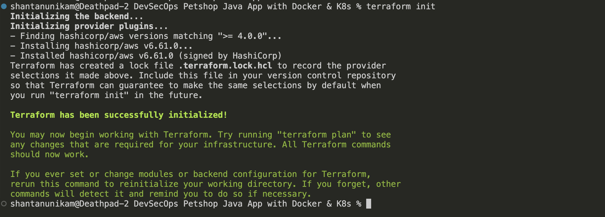

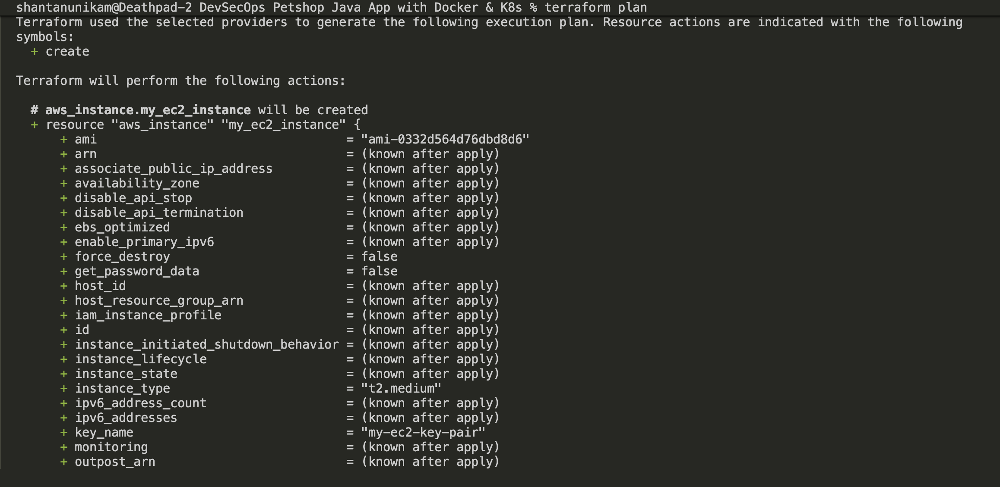

Initialize and apply the Terraform configuration:

```c
terraform init
terraform apply
```
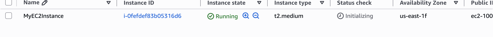


## **Step 2: Install Jenkins, Docker, and Trivy**

SSH into the EC2 instance with your key pair and run the following commands:

```go
# Update packages
sudo apt update -y

# Install Jenkins
sudo wget -O /etc/yum.repos.d/jenkins.repo     https://pkg.jenkins.io/rpm-stable/jenkins.repo
sudo rpm --import https://pkg.jenkins.io/rpm-stable/jenkins.io-2026.key
sudo yum upgrade
sudo yum install java-21-amazon-corretto -y
sudo yum install jenkins -y
sudo systemctl enable jenkins
sudo systemctl start jenkins
sudo systemctl status jenkins

# Install Docker
sudo yum install -y docker
sudo usermod -aG docker ${USER}
newgrp docker
sudo chmod 777 /var/run/docker.sock

# Install Trivy
cat << EOF | sudo tee -a /etc/yum.repos.d/trivy.repo
[trivy]
name=Trivy repository
baseurl=https://aquasecurity.github.io/trivy-repo/rpm/releases/\$basearch/
gpgcheck=1
enabled=1
gpgkey=https://aquasecurity.github.io/trivy-repo/rpm/public.key
EOF
sudo yum -y update
sudo yum -y install trivy

# Install git
sudo yum install git

```

since Apache Maven’s default proxy is 8080, we need to change the port of Jenkins from 8080 to let’s say 8090, for that:

```c
sudo systemctl stop jenkins
sudo systemctl status jenkins
sudo systemctl edit jenkins
Change Environments="Jenkins_port=8090" save and exit
sudo systemctl daemon-reload
sudo systemctl restart jenkins
sudo systemctl status jenkins
```

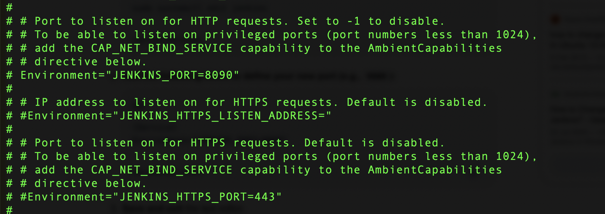

Now, grab your Public IP Address

```c
<EC2 Public IP Address:8090>
# for jenkins password
sudo cat /var/lib/jenkins/secrets/initialAdminPassword
# change the password once you set up jenkins server
```

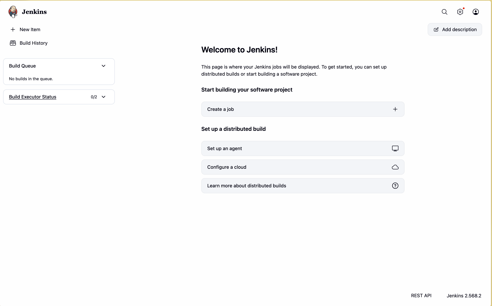

After the docker installation, we create a SonarQube container:

```c
docker run -d --name sonar -p 9000:9000 sonarqube:lts-community
```

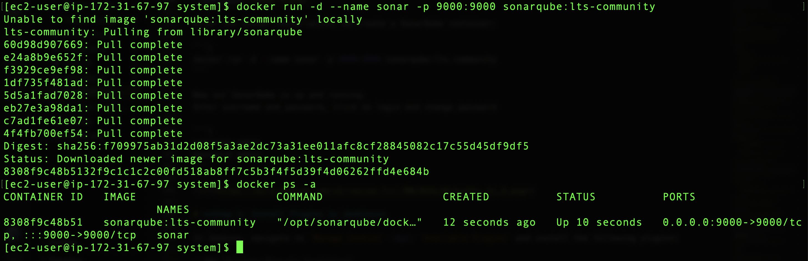

Now our SonarQube is up and running.  
Enter username and password, click on login and change password

```c
username admin
password admin
password admin123
```

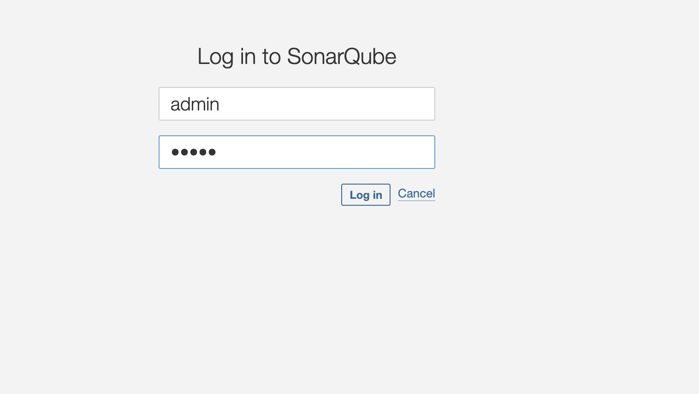

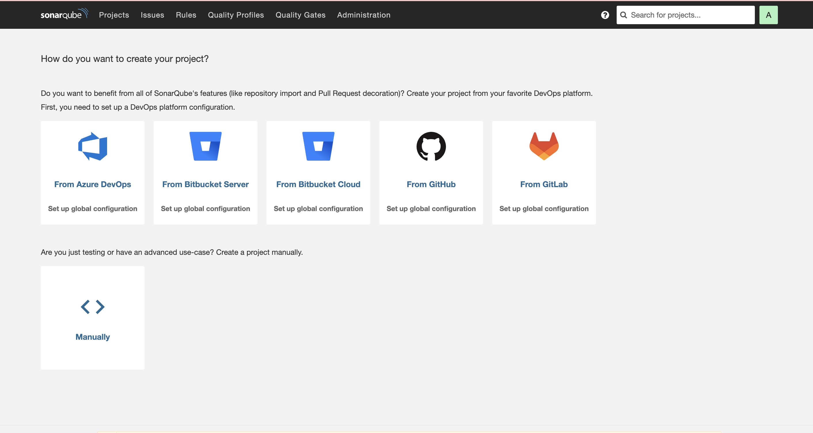

# **Step 3: Install Plugins in Jenkins**

In Jenkins, navigate to `Manage Jenkins` -&gt; `Available Plugins` and install the following plugins:

* JDK (Eclipse Temurin Installer)

* SonarQube Scanner

* Maven

* OWASP Dependency Check

Configure Java and Maven in Global Tool Configuration  
Go to Manage Jenkins → Tools → Install JDK(17) and Maven3(3.6.0) → Click on Apply and Save


Create a New Job with a Pipeline option:

Pipeline script:

```c
pipeline{
    agent any
    tools {
        jdk 'jdk17'
        maven 'maven3'
    }
    stages{
        stage ('clean Workspace'){
            steps{
                cleanWs()
            }
        }
        stage ('checkout scm') {
            steps {
                git  'https://github.com/Harshit-cyber-bit/jpetstore-6'
            }
        }
        stage ('maven compile') {
            steps {
                sh 'mvn clean compile'
            }
        }
        stage ('maven Test') {
            steps {
                sh 'mvn test -DskipTests=true'
            }
        }
   }
}
```

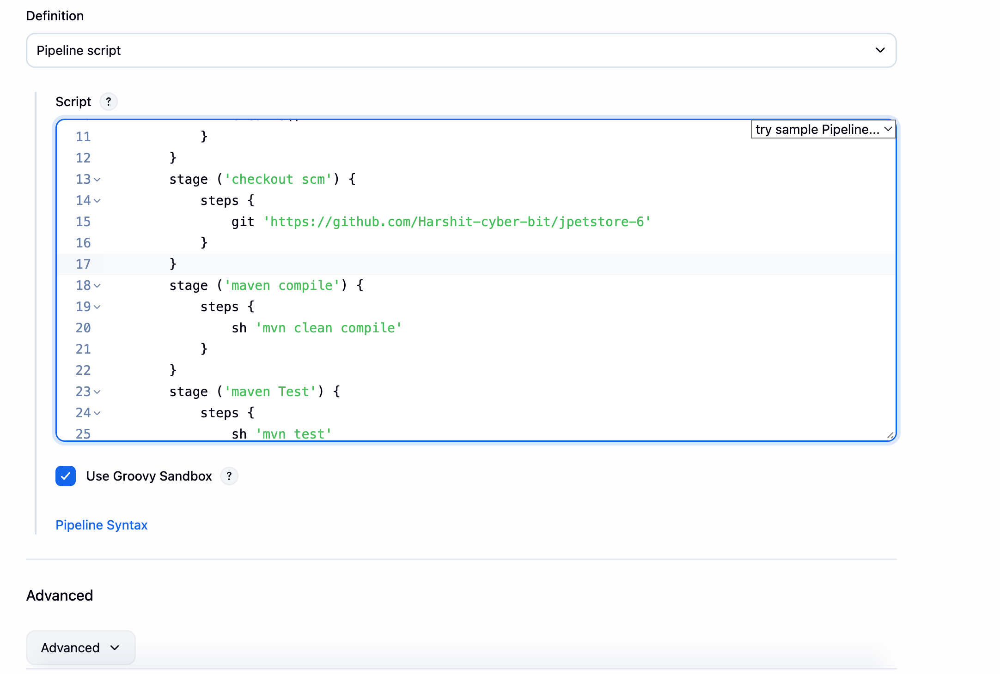

insert in the Script box and then apply and save

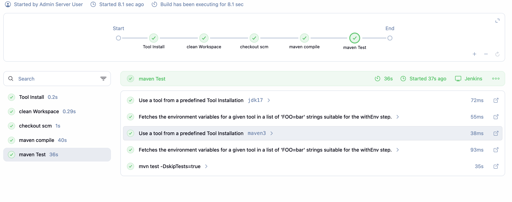

## **Step 4: Configure SonarQube Server in Jenkins**

Retrieve the Public IP Address of your EC2 instance. Since SonarQube operates on Port 9000, you can access it via `<Public IP>:9000`.  
**To proceed, navigate to your SonarQube server, then follow these steps:  
**Click on Administration → Security → Users → Tokens. Next, update and **copy** the token by providing a name and clicking on Generate Token.


Go to the Jenkins Dashboard, then navigate to Manage Jenkins → Credentials → Add Secret Text. The screen should look like this:

Next, go to the Jenkins Dashboard, then navigate to Manage Jenkins → System, and add the necessary configuration as shown in the image below.

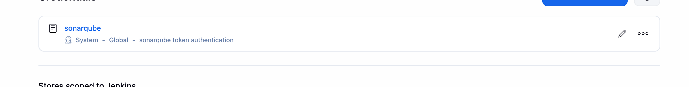

Click on apply and save

Now, we will install a sonar scanner in the tools.

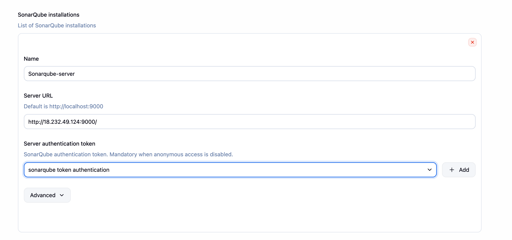


Click on apply and save

In the SonarQube Dashboard, add a quality gate by navigating to Administration → Configuration → Webhooks.

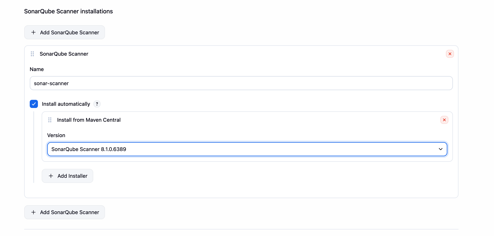

Add details

```c
#Name- jenkins
#in url section of quality gate
<http://jenkins-public-ip:8090>/sonarqube-webhook/
#leave the secret box blank
```

Now add this script in pipeline (Dashboard→ petstore→ configuration) and test the steps of SonarQube which we did:

```c
#under tools section add this environment
environment {
        SCANNER_HOME=tool 'sonar-scanner'
    }
# in stages add this
stage("Sonarqube Analysis "){
            steps{
                withSonarQubeEnv('sonar-server') {
                    sh ''' $SCANNER_HOME/bin/sonar-scanner -Dsonar.projectName=Petshop \
                    -Dsonar.java.binaries=. \
                    -Dsonar.projectKey=Petshop '''
                }
            }
        }
        stage("quality gate"){
            steps {
                script {
                  waitForQualityGate abortPipeline: false, credentialsId: 'Sonar-token'
                }
           }
        }
```

Apply, save and build. Now, go to your SonarQube Server and go to project:

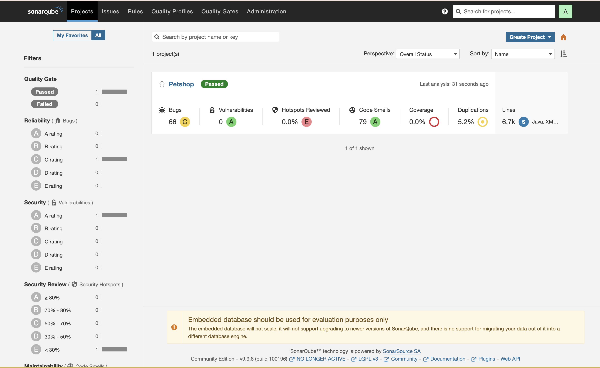

you can see the result

## **Step 5: Install OWASP Dependency Check Plugins**

Go to the Jenkins Dashboard, then click on Manage Jenkins → Plugins. Find the OWASP Dependency-Check plugin, click on it, and install it without requiring a restart.

After installing the plugin, proceed to configure the tool by navigating to Dashboard → Manage Jenkins → Tools →.

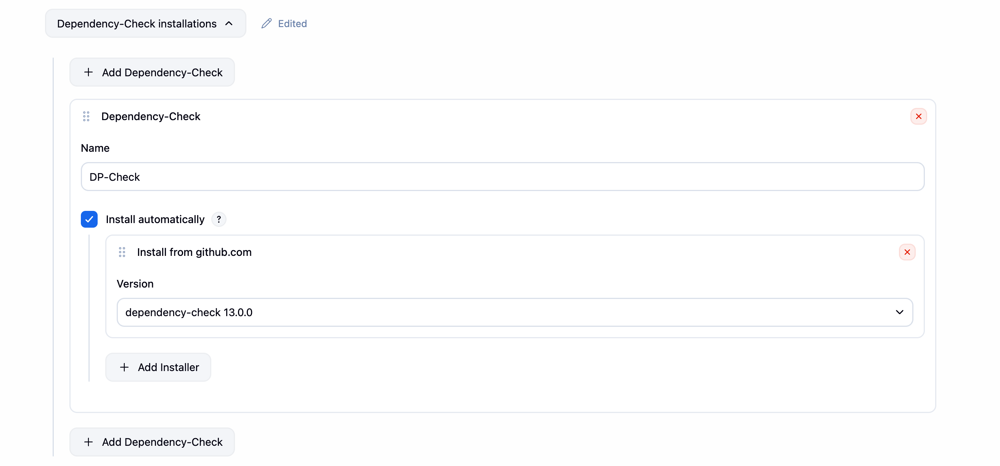

apply and save

Add the script of OWASP in pipeline now:

```c
stage ('Build war file'){
            steps{
                sh 'mvn clean install -DskipTests=true'
            }
        }
        stage("OWASP Dependency Check"){
            steps{
                dependencyCheck additionalArguments: '--scan ./ --format XML ', odcInstallation: 'DP-Check'
                dependencyCheckPublisher pattern: '**/dependency-check-report.xml'
            }
        }
```
```c
As i was using a lower version of instance , the 

Apply, save and build.

# Create a 2GB swap file
sudo fallocate -l 2G /swapfile

# Secure the permissions
sudo chmod 600 /swapfile

# Set up Linux swap area
sudo mkswap /swapfile

# Enable the swap space
sudo swapon /swapfile

# Verify swap is active
free -h
```
You can see the report,

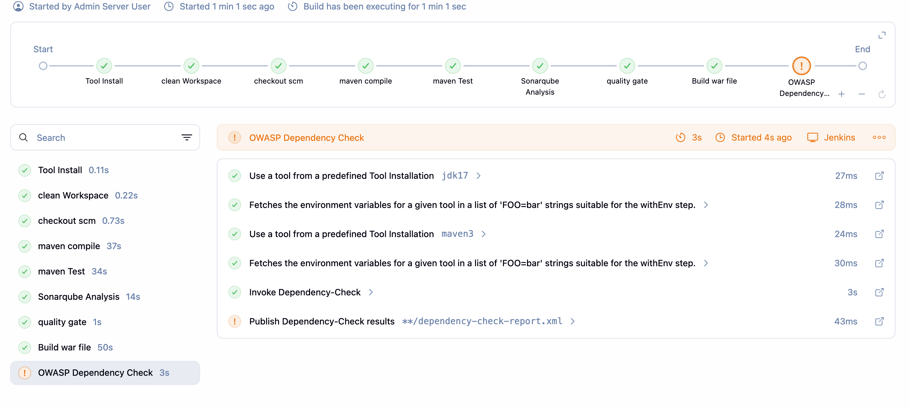

Did'nt have the free NVD API Key ... and honestly don't want to check the website to request it.

# **Step 6: Docker Set-up**

In Jenkins, navigate to `Manage Jenkins` -&gt; `Available Plugins` and install these:  
`- Docker   - Docker Commons   - Docker Pipeline   - Docker API   - docker-build-step`

Now, go to Dashboard → Manage Jenkins → Tools →

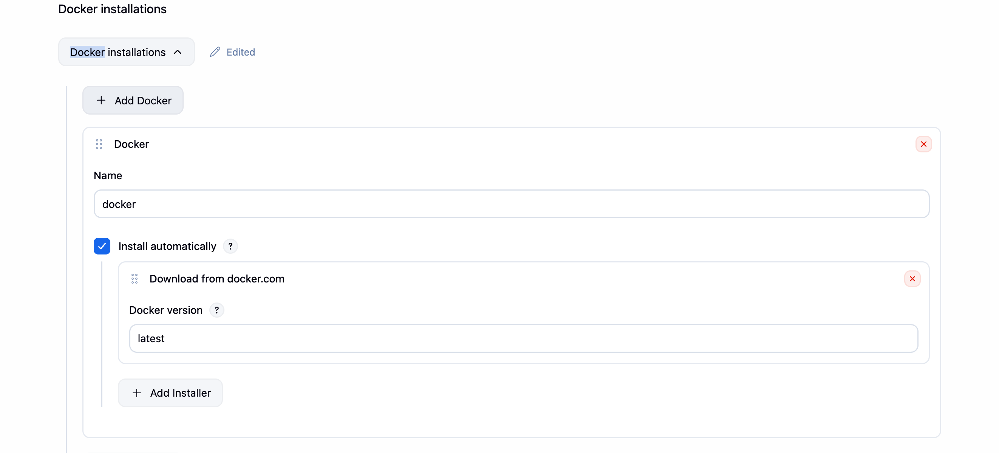

apply and save

Add DockerHub Username and Password (Access Token) in Global Credentials:

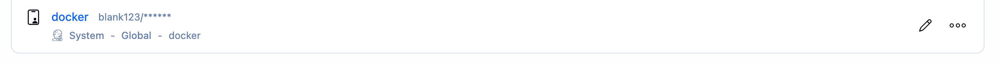

## **Step 7: Adding Ansible Repository and Install Ansible**

Connect to your instance via SSH and run this commands, to install Ansible on your server:

```c
sudo dnf update -y
sudo dnf install python3-pip -y
sudo python3 -m pip install ansible

ansible --version #to check if it installed properly or not
```

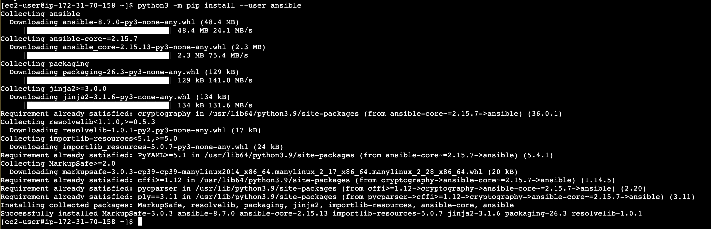

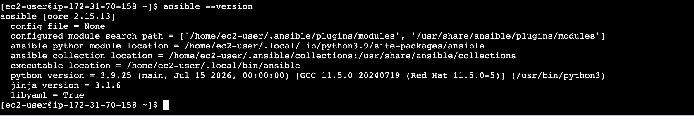

To add inventory you can create a new directory or add in the default Ansible hosts file

```c
cd /etc/ansible
sudo vi hosts
```

```c
[local]
<Ip-of-Jenkins>
```

save and exit.

Install Ansible Plugins by navigating to `Manage Jenkins` -&gt; `Available Plugins.`

Now add Credentials to invoke Ansible with Jenkins.

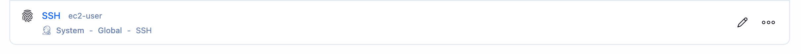

In the Private key section, paste your .pem key file content directly.

Check your Ansible path on the server by,

```c
which ansible
```

copy the path and paste it here:

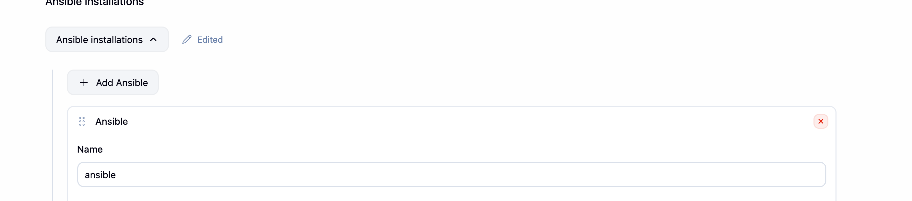

Now, create an Ansible playbook that builds a Docker image, tags it, pushes it to Docker Hub, and then deploys it in a container using Ansible.

It is already in github repo but you need to modify with your DockerHub credentials:


Include this stage in the pipeline to build the Docker image, push it to Docker Hub, and run the container:

```c
stage('Install Docker') {
            steps {
                dir('Ansible'){
                  script {
                         ansiblePlaybook credentialsId: 'ssh', disableHostKeyChecking: true, installation: 'ansible', inventory: '/etc/ansible/', playbook: 'Ansible/docker-playbook.yaml'
                        }
                   }
              }
        }
```

Now after build process of the pipeline you would be able to see the result of web application by visiting the below url:

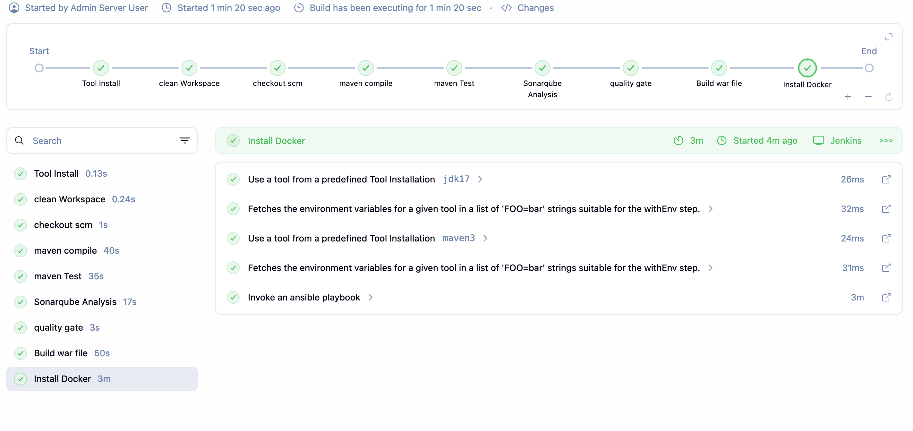

```c
<jenkins-ip:8081>/jpetstore
```

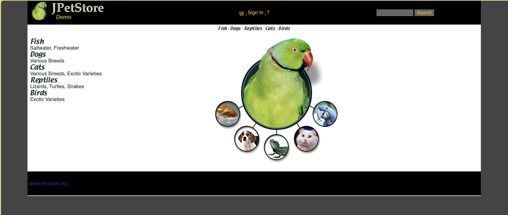

## **Step 8: Kubernetes Setup**

Create two instance for Kubernetes Master-Slave set up, you can use the below terraform code or create traditionally by using AWS Console:

Install Kubectl and Minikube on Jenkins machine,

```c
# Install kubectl
sudo apt-get update
curl -LO "https://dl.k8s.io/release/$(curl -L -s https://dl.k8s.io/release/stable.txt)/bin/linux/amd64/kubectl"
chmod +x ./kubectl
sudo mv ./kubectl /usr/local/bin/kubectl
kubectl version --client

# Install Minikube
curl -LO https://storage.googleapis.com/minikube/releases/latest/minikube-linux-amd64
sudo install minikube-linux-amd64 /usr/local/bin/minikube
minikube start --driver=docker
minikube start
```

**for simplicity, connect both newly created instance via SSH in side-by-side terminal and change their hostname to master and worker, we can do by using this command:**

```c
sudo su
hostname master #and worker in second one
bash
clear
```

Now run this commands in both **master** and **worker** node:

```c
sudo yum install -y docker
sudo usermod -aG docker ${USER}
newgrp docker
sudo chmod 777 /var/run/docker.sock


sudo dnf install -y containerd
sudo systemctl enable --now containerd

cat <<EOF | sudo tee /etc/yum.repos.d/kubernetes.repo
[kubernetes]
name=Kubernetes
baseurl=https://pkgs.k8s.io/core:/stable:/v1.28/rpm/
enabled=1
gpgcheck=1
gpgkey=https://pkgs.k8s.io/core:/stable:/v1.28/rpm/repodata/repomd.xml.key
EOF

# 2. Update package list and install kubelet, kubeadm, and kubectl
sudo dnf update -y
sudo dnf install -y kubelet kubeadm kubectl --disableexcludes=kubernetes

# 3. Enable the kubelet service
sudo systemctl enable --now kubelet
```

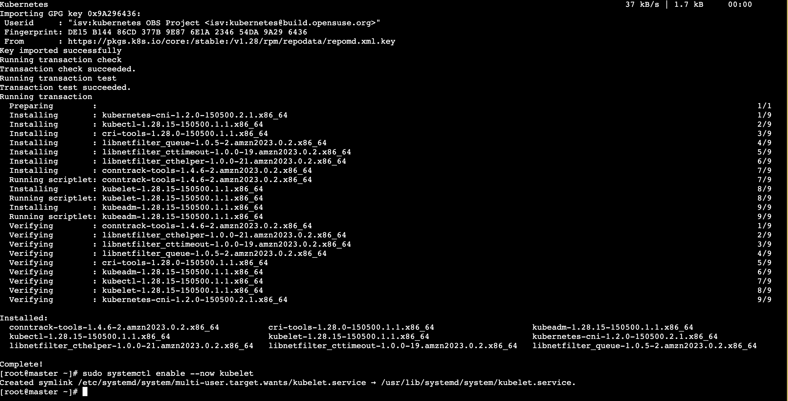

## **In master instance,**

```c
# 1. Initialize the Kubernetes control plane
sudo kubeadm init --pod-network-cidr=10.244.0.0/16

# 2. Configure kubectl access for the current non-root user
mkdir -p $HOME/.kube
sudo cp -i /etc/kubernetes/admin.conf $HOME/.kube/config
sudo chown $(id -u):$(id -g) $HOME/.kube/config

# 3. Apply the updated Flannel CNI network plugin
kubectl apply -f https://github.com/flannel-io/flannel/releases/latest/download/kube-flannel.yml
```

## **In worker instance,**

```c
sudo kubeadm join <master-node-ip>:<master-node-port> --token <token> --discovery-token-ca-cert-hash <hash>
```

Copy the config file to Jenkins master or the local file manager and save it, you can find it in master node by,

```c
cd /.kube
cat config
```

copy it and save it in documents or another folder save it as secret-file.txt.

Install k8s plugins in jenkin,


Now, go to Manage Jenkins –&gt; Credentials –&gt;System–&gt; Global Credential–&gt; Add Credentials


## **Step 9: Master-Slave Setup for Ansible and Kubernetes**

To enable communication with the Kubernetes clients, we need to create an SSH key on the Ansible node and share it with the Kubernetes master system.

**On main (on which we are running jenkins, not the master-worker) instance,**

```c
ssh-keygen
```


Change the directory to .ssh and copy the public key (id\_[**rsa.pub**](http://rsa.pub/))

```c
cd .ssh
cat id_rsa.pub  #copy this public key
```

After copying the public key from the Ansible Main, navigate to the `.ssh` directory on the Kubernetes master machine and paste the copied public key into the `authorized_keys` file.

```c
cd .ssh #on k8s master 
sudo vi authorized_keys
```

> *Note: Add the copied public key as a new line in the* `authorized_keys` file without deleting any existing keys, then save and exit.

By adding the public key from the main to the Kubernetes machine, keyless access is now configured. To verify, try accessing the Kubernetes master using the following command format.

```c
ssh ubuntu@<public-ip-k8s-master>
```

Now, open the hosts file on the Ansible server and add the public IP of the Kubernetes master.


> *Please note that here Ansible-master referring to Main instance which we created first in this project and the other ones are k8s-master and k8s-slave.*

```c
[k8s]
public ip of k8s-master
```

## **Test Ansible Master Slave Connection**

```c
ansible -m ping all #on main instance
```

Add the stage in pipeline and build the job:

```c
stage('k8s using ansible'){
            steps{
                dir('Ansible') {
                    script{
                        ansiblePlaybook credentialsId: 'ssh', disableHostKeyChecking: true, installation: 'ansible', inventory: '/etc/ansible/', playbook: 'kube.yaml'
                    }
                }
            }
        }
```

In the Kubernetes cluster give this command

```c
kubectl get all
kubectl get svc
```

```c
<slave-ip:serviceport(30699)>/jpetstore
# port may vary, you can check it from the above cmd (kubectl get all)
```


## **Complete Pipeline:**

```go
pipeline{
    agent any
    tools {
        jdk 'jdk17'
        maven 'maven3'
    }
    environment {
        SCANNER_HOME=tool 'sonar-scanner'
    }
    stages{
        stage ('clean Workspace'){
            steps{
                cleanWs()
            }
        }
        stage ('checkout scm') {
            steps {
                git 'https://github.com/your-github-repo'
            }
        }
        stage ('maven compile') {
            steps {
                sh 'mvn clean compile'
            }
        }
        stage ('maven Test') {
            steps {
                sh 'mvn test'
            }
        }
        stage("Sonarqube Analysis "){
            steps{
                withSonarQubeEnv('sonar-server') {
                    sh ''' $SCANNER_HOME/bin/sonar-scanner -Dsonar.projectName=Petstore \
                    -Dsonar.java.binaries=. \
                    -Dsonar.projectKey=Petstore '''
                }
            }
        }
        stage("quality gate"){
            steps {
                script {
                  waitForQualityGate abortPipeline: false, credentialsId: 'Sonar-token'
                }
           }
        }
        stage ('Build war file'){
            steps{
                sh 'mvn clean install -DskipTests=true'
            }
        }
        stage("OWASP Dependency Check"){
            steps{
                dependencyCheck additionalArguments: '--scan ./ --format XML ', odcInstallation: 'DP-Check'
                dependencyCheckPublisher pattern: '**/dependency-check-report.xml'
            }
        }
        stage('Ansible docker Docker') {
            steps {
                dir('Ansible'){
                  script {
                        ansiblePlaybook credentialsId: 'ssh', disableHostKeyChecking: true, installation: 'ansible', inventory: '/etc/ansible/', playbook: 'docker.yaml'
                    }
                }
            }
        }
        stage('k8s using ansible'){
            steps{
                dir('Ansible') {
                    script{
                        ansiblePlaybook credentialsId: 'ssh', disableHostKeyChecking: true, installation: 'ansible', inventory: '/etc/ansible/', playbook: 'kube.yaml'
                    }
                }
            }
        }
   }
}
```

## **Conclusion**

By following these steps, we successfully deployed a Java-based Petshop application using Jenkins, Docker, Kubernetes, Terraform, SonarQube, Trivy, and Ansible. This project not only demonstrates a comprehensive approach to modern application deployment but also highlights the importance of automation and security in the DevOps pipeline.

This journey has been a valuable learning experience, from infrastructure provisioning to continuous integration and deployment, containerization, orchestration, and ensuring robust security measures. I hope this detailed guide helps you in your own deployment projects and inspires you to explore the powerful tools and techniques in the DevSecOps realm.


ssh-rsa AAAAB3NzaC1yc2EAAAADAQABAAABgQDe+X2Tvln4nJ22fnQb2dhM8uw7l8BCZJ2iHOKj85C7xlQ+rgagUon7CExfW6vGLpyTBndG127rPr7TINBIVWtfR1BDheBgJ2j+/ZdL8eKZMtUbpNC8SXcmjRzWUNItf9sFUl8DNkLak4pJ5dnPijXmKV1dn1xrTEEzAMtYi+0vvBHuXZURVcm3ujZPk5V1HCPrpjryyICkQhBR44fQh5AGYDM6ZCNEtPWH644Q5BAsF/jws0r5GurAu2+DQpjVtf1goI2uje2ZTFOdosaC3aocbT0wUrjP8V1wM51sQlCD5hTWfUYlccO9drnOO/qQoET4MMMWemPQuOwFoZiaJoH1SkXj2+kyI6G4MMWx3BAOkokFi+TaaVNXmXOuXfDwnisu3U8UUCP65JLqi/Jv39U22TUrYkP9+2rdd4WXYDpZ1CcRTmjb35BmynQgcAEb2GwzwDP4yYqyMXbKJjzgj8J6m/dPprEX4COWjF0vp1kbnXsvSgx9f5b1CGeXhqNioak= jenkins@ip-172-31-75-57.ec2.internal