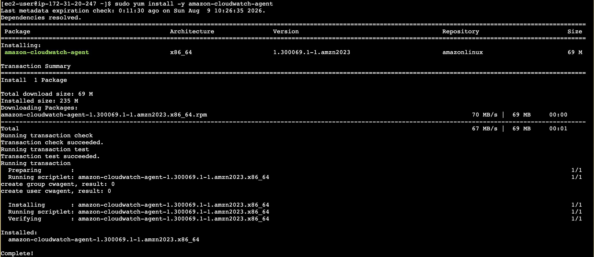
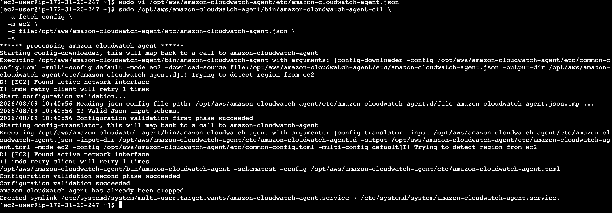
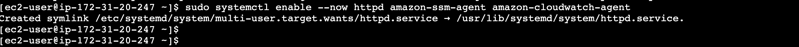
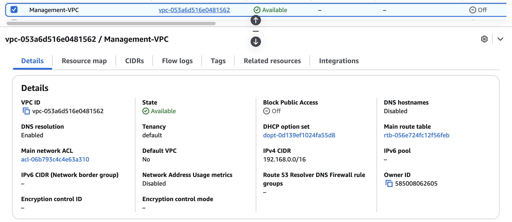
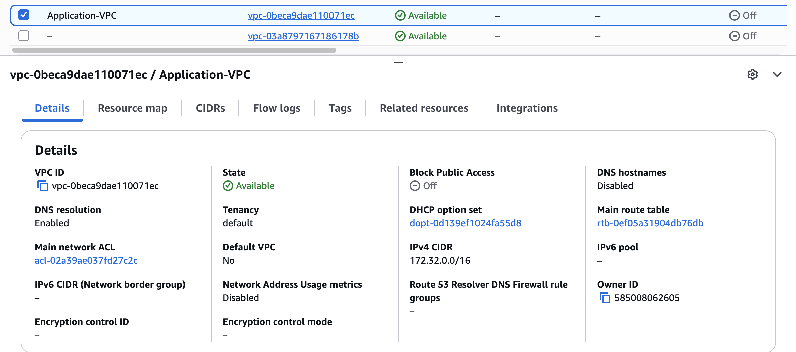
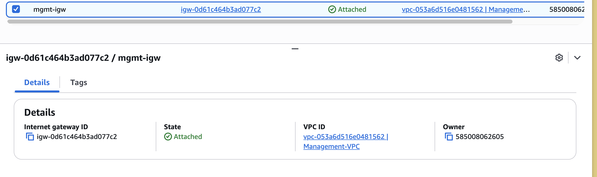
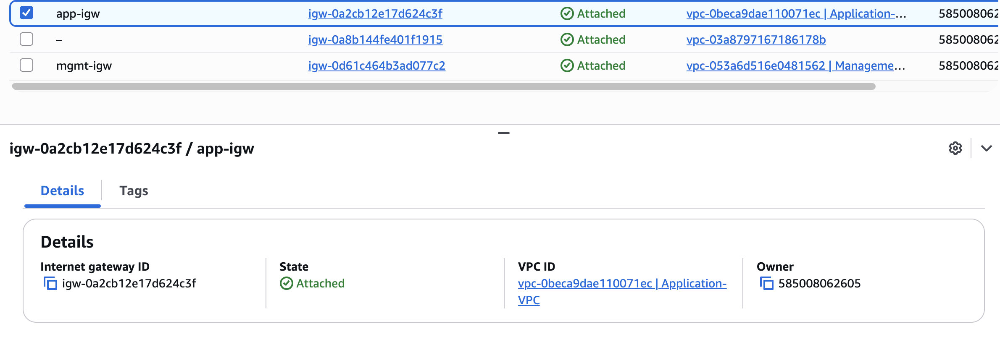
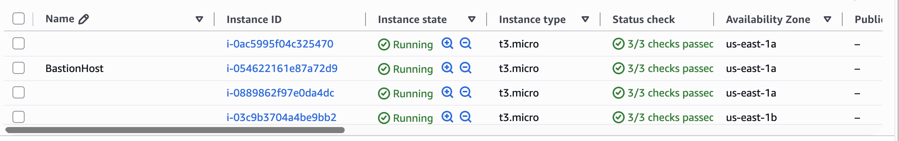
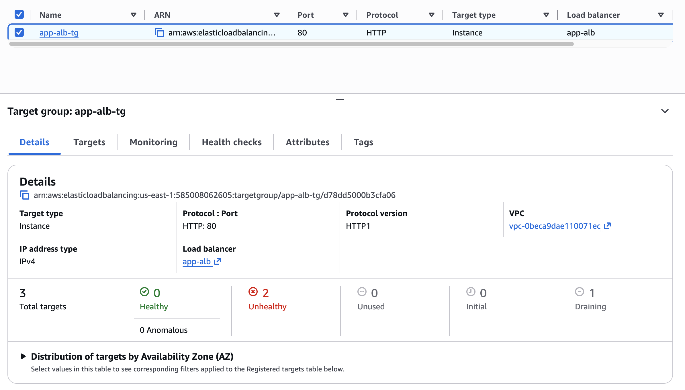
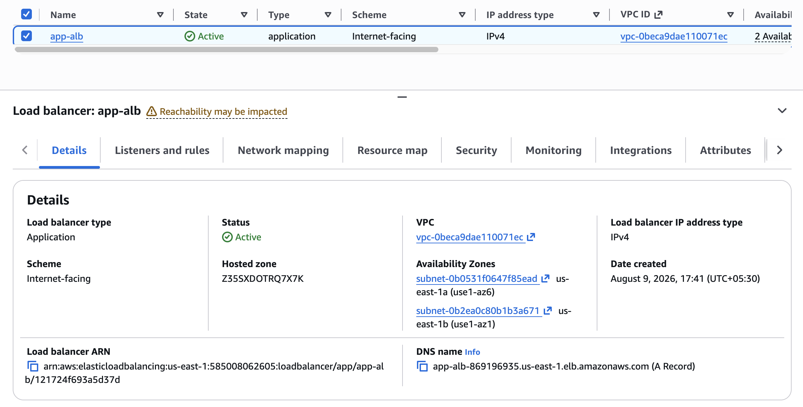

# Deploy Scalable VPC Architecture on AWS Cloud

## Goal

Deploy a Modular and Scalable Virtual Network Architecture with Amazon VPC.

## Pre-Requisites

1. You must be having an [AWS account](https://aws.amazon.com/) to create infrastructure resources on AWS cloud.
2. [Source Code](https://github.com/NotHarshhaa/DevOps-Projects/blob/master/DevOps-Project-02/html-web-app)

## Pre-Deployment

Customize the application dependencies mentioned below on AWS EC2 instance and create the Golden AMI.

1. AWS CLI
2. Install Apache Web Server
3. Install Git
4. Cloudwatch Agent

5. Push custom memory metrics to Cloudwatch.

6. AWS SSM Agent

## VPC Deployment

1. Build VPC network ( 192.168.0.0/16 ) for Bastion Host deployment as per the architecture shown above.

2. Build VPC network ( 172.32.0.0/16 ) for deploying Highly Available and Auto Scalable application servers as per the architecture shown above.

3. Create NAT Gateway in Public Subnet and update Private Subnet associated Route Table accordingly to route the default traffic to NAT for outbound internet connection.
4. Create Transit Gateway and associate both VPCs to the Transit Gateway  for private communication.
5. Create Internet Gateway for each VPC and Public Subnet associated Route Table accordingly to route the default traffic to IGW for inbound/outbound internet connection.

6. Create Cloudwatch Log Group with two Log Streams to store the VPC Flow Logs of both VPCs.
7. Enable Flow Logs for both VPCs and push the Flow Logs to Cloudwatch Log Groups and store the logs in the respective Log Stream for each VPC.
8. Create Security Group for bastion host allowing port 22 from public.
9. Deploy Bastion Host EC2 instance in the Public Subnet with EIP associated.
10. Create S3 Bucket to store application specific configuration.
11. Create Launch Template with below configuration (replacing deprecated Launch Configuration).
    1. Golden AMI
    2. Instance Type – t3.micro (updated from t2.micro for better performance)
    3. Userdata to pull the code from Git Repository to document root folder of webserver and start the httpd service.
    4. IAM Role granting access to Session Manager and to S3 bucket created in the previous step to pull the configuration. (Do not grant S3 Full Access)
    5. Security Group allowing port 22 from Bastion Host and Port 80 from Public.
    6. Key Pair
12. Create Auto Scaling Group with Min: 2 Max: 4 with two Private Subnets associated to multiple AZs for high availability.

13. Create Target Group and associate it with ASG.

14. Create Application Load Balancer (ALB) in Public Subnets for better layer 7 routing and add Target Group as target.

## Validation

1. As DevOps Engineer login to Private Instances via Bastion Host.
2. Login to AWS Session Manager and access the EC2 shell from console.
3. Browse web application from public internet browser using domain name and verify that page loaded.

## 🛠️ Author & Community  

This project is crafted by **[Harshhaa](https://github.com/NotHarshhaa)** 💡.  
I’d love to hear your feedback! Feel free to share your thoughts.  

📧 **Connect with me:**

- **GitHub**: [@NotHarshhaa](https://github.com/NotHarshhaa)  
- **Blog**: [ProDevOpsGuy](https://blog.prodevopsguytech.com)  
- **Telegram Community**: [Join Here](https://t.me/prodevopsguy)  
- **LinkedIn**: [Harshhaa Vardhan Reddy](https://www.linkedin.com/in/harshhaa-vardhan-reddy/)  

---

## ⭐ Support the Project  

If you found this helpful, consider **starring** ⭐ the repository and sharing it with your network! 🚀  

### 📢 Stay Connected  

